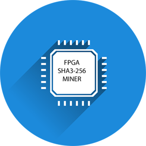
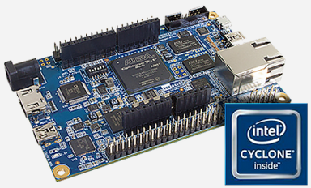

# DE10 NANO SHA3 FPGA Miner



Want to support this open source project? Please star it. Want to contribute?
Feel free to create pull requests following the normal github process.

## Table of Contents

* [Introduction](#introduction)
* [Implementation](#implementation)
* [User API](#user-api)
* [Installing](#installing)
* [Disclaimer](#disclaimer)

## Introduction

In mining a proof-of-work (POW) is used to verify the authenticity of a blockchain entry. What is a POW?
A POW is a mathematical puzzle which is difficul to solve but easy to verify.

For this example an FPGA mining core is defined for a hypothetical blockchain that uses the SHA3-256 hash.

We are given:

- H: 256 bit header of fixed value
- N: 64 bit nonce
- D: 256 bit difficulty

The problem we need to solve is to find any value of N, such that the SHA3-256 hash of the nonce concatenated
to the header, is less than or equal to the difficulty:

D >= SHA3({H, N})

NOTE: This will not mine a real blockchain. It would be well suited to mine the ETC chain as proposed
in [ECIP-1049](https://github.com/ethereumclassic/ECIPs/issues/13)

## Implementation

A bootable SD card image for the
[DE10 NANO](https://software.intel.com/content/www/us/en/develop/topics/iot/hardware/fpga-de10-nano.html),
a low cost FPGA development board equipped with an Intel 5CSEBA6U23I7NDK FPGA. The FPGA includes a dual
core ARM hard processor. Ubuntu 16.04 is booted and supports the pre-installed FPGA image availlable
[here](https://github.com/miscellaneousbits/DE10_NANO_SOC_MINIMAL.git) and kernel driver support.

In order to provide the maximum FPGA routing resources to the mining core, HDMI, keyboard, and mouse
support have been removed. You can log in to the console either via the USB UART or SSH.

## User API

The driver models the 23 32-bit miner core registers as file /dev/miner0. It supports these file operations.

- open
- close
- lseek (must be to a 4 byte boundary)
- read (must be for a length of 4 bytes)
- write (must be for a length of 4 bytes)
- poll/ppoll/select (wait for solution)

Only single register reads and writes are supported.

### File map

| Offset | Name | Read/Write | Description|
| --- | --- | --- | --- |
| 0 | SOLN_REG | RO | 64-bit Solution |
| 8 | STATUS_REG | RO | 32-bit Status (see below) |
| 12 | SHA3_REG | RO | 32-bit Fingerprint "SHA3" |
| 16 | HDR_REG | RW | 256-bit Header |
| 48 | DIFF_REG | RW | 256-bit Difficulty |
| 80 | START_REG | RW | 64-bit Start nonce |
| 88 | CTL_REG | RW | 32-bit Control (see below) |

### Status register

| Bit # | Name | Description |
| --- | --- | --- |
| 0 | FOUND | Solution found. Solution is stored and IRQ is set. IRQ cleared with next ctl. reg. read. |
| 1 | RUNNING | The run ctl bit is set and the solution nonce is auto-incrementing |
| 2 | TESTING | The test ctl bit is set and compare diff equal |
| 15-8 | MINER_FREQ | Miner clock frequency in MHZ |
| 19-16 | MAJ_VER | Miner core major version |
| 23-20 | MIN_VER | Miner core minor version |

### Control register

| Bit # | Name | Description |
| --- | --- | --- |
| 0 | RUN | 0 - clear, 1 - auto increment the solution nonce and check hashes |
| 1 | TEST | 0 - normal mode, 1 - test mode, look for exact match with diff |
| 2 | HALT | 0 - normal mode, 1 - halt mining and raise interrupt |
| 23-16 | PAD_LAST | last pad byte, 0x80 for KECCACK-256 and SHA3-256 |
| 31-24 | PAD_FIRST | first pad byte, 0x01 for KECCACK-256, and 0x06 for SHA3-256 |

## Installing

### Prerequisites



- DE10-NANO
- Desk/Laptop (Windows or Linux Ubuntu/Debian) to run terminal.

### Download and install

Download the latest release version from this project. Using dd on Linux, or Win32DiskImager on Windows,
unzip and copy the image file a to an 8GB or greater SD card. Insert the SD card in the DE10-NANO card slot,
and power up. You can log in as user **root** and password **miner**.

The first thing to do is to expand the root partition. Making sure you note the partition
start sector.

```
de10nano login: root
Password: 
Last login: Fri Jul 24 20:51:03 UTC 2020 on ttyS0
root@de10nano:~# fdisk /dev/mmcblk0

Welcome to fdisk (util-linux 2.27.1).
Changes will remain in memory only, until you decide to write them.
Be careful before using the write command.


Command (m for help): p
Disk /dev/mmcblk0: 119.4 GiB, 128177930240 bytes, 250347520 sectors
Units: sectors of 1 * 512 = 512 bytes
Sector size (logical/physical): 512 bytes / 512 bytes
I/O size (minimum/optimal): 512 bytes / 512 bytes
Disklabel type: dos
Disk identifier: 0xbdf7f996

Device         Boot  Start     End Sectors  Size Id Type
/dev/mmcblk0p1        2048  206848  204801  100M  b W95 FAT32
/dev/mmcblk0p2      227331 5309243 5081913  2.4G 83 Linux <<== Make note of partition two'2 start sector
/dev/mmcblk0p3      206849  227330   20482   10M a2 unknown

Partition table entries are not in disk order.

Command (m for help): d
Partition number (1-3, default 3): 2

Partition 2 has been deleted.

Command (m for help): n
Partition type
   p   primary (2 primary, 0 extended, 2 free)
   e   extended (container for logical partitions)
Select (default p): 
Partition number (2,4, default 2): 
First sector (227331-250347519, default 229376): 227331 <<== Use the same partition start address as noted above
Last sector, +sectors or +size{K,M,G,T,P} (227331-250347519, default 250347519): 

Created a new partition 2 of type 'Linux' and of size 119.3 GiB.

Command (m for help): w
The partition table has been altered.
Calling ioctl() to re-read partition table.
Re-reading the partition table failed.: Device or resource busy

The kernel still uses the old table. The new table will be used at the next reboot or after you run partprobe(8) or kpa.

root@de10nano:~# sync; reboot
```

Now that the partition is expanded, resize the root file system.


```
de10nano login: root
Password: 
Last login: Thu Feb 11 16:28:12 UTC 2016 on ttyS0
root@de10nano:~# lsblk
NAME        MAJ:MIN RM   SIZE RO TYPE MOUNTPOINT
mmcblk0     179:0    0 119.4G  0 disk 
├─mmcblk0p2 179:2    0 119.3G  0 part /
├─mmcblk0p3 179:3    0    10M  0 part 
└─mmcblk0p1 179:1    0   100M  0 part 

root@de10nano:~# resize2fs /dev/mmcblk0p2
resize2fs 1.42.13 (17-May-2015)
Filesystem at /dev/mmcblk0p2 is mounted on /; on-line resizing required
old_desc_blocks = 1, new_desc_blocks = 8
The filesystem on /dev/mmcblk0p2 is now 31265023 (4k) blocks long.

root@de10nano:~# df -h
Filesystem      Size  Used Avail Use% Mounted on
/dev/root       118G  2.4G  111G   3% /
devtmpfs        503M     0  503M   0% /dev
tmpfs           504M     0  504M   0% /dev/shm
tmpfs           504M  6.7M  497M   2% /run
tmpfs           5.0M     0  5.0M   0% /run/lock
tmpfs           504M     0  504M   0% /sys/fs/cgroup
tmpfs           101M     0  101M   0% /run/user/0

root@de10nano:~# sync; reboot
```

You can now build and run the miner core test

```
root@de10nano:~# cd linux-socfpga-sha3-miner/tools/testing/miner/
root@de10nano:~/linux-socfpga-sha3-miner/tools/testing/miner# make
main.c -> main.o
sha3.c -> sha3.o
main.o sha3.o -> test
root@de10nano:~/linux-socfpga-sha3-miner/tools/testing/miner# ./test

Poll test
Test 0 65dfa39a0a83fb3d ................................................
Test 1 6c72d7f078940716 ................................................
Test 2 28eb54c3476fbf82 ................................................
Test 3 2a5cef7445664a1b ................................................
Test 4 7cb5be3c59c42fa6 ................................................
Test 5 2c763b2d7ecf7788 ................................................
Test 6 3e042487198ba6d7 ................................................
Test 7 0feb23d55d63b49c ................................................
Test 8 63bd2e361052819c ................................................
Test 9 10e6e17217bdb469 ................................................
PASS

Interrupt test
Test 0 5c7fe25e3ca56e20 ................................................
Test 1 260f89a12b716660 ................................................
Test 2 695b5f044b0fa345 ................................................
Test 3 28428d5d5e29bc4c ................................................
Test 4 722f0a916800ce17 ................................................
Test 5 0ae6184d15f17c69 ................................................
Test 6 45ee8c2e1c7f69dc ................................................
Test 7 71f8b36b7bec6558 ................................................
Test 8 1d11692847da8788 ................................................
Test 9 46f93acb58c54cf9 ................................................
PASS

Checking hash rate
Miner clock 75 MHz, pipeline stages 8, expected hash rate 25.00 MH/S
Measured 25.00 MH/S
PASS

Mining test

Search 1
Header:     c2a6aa466bbf733ae386ae672bd6c0255168ca348a4ea229ee5a672a626eb17b
Start:      66d7917730b39d2a
Solution:   66d791773a64b9cf (162,602,149 hashes in 6.504 seconds)
Hash:       000000065875bea2d24269231c8859ad3d5872b0954835aee36be917564d4c5c
Difficulty: 00000007ffffffffffffffffffffffffffffffffffffffffffffffffffffffff
PASS

Search 2
Header:     e466e124e4d1da64fb61ac3ff1d2fa6c33bf0b445c427f5f747d212785ee2551
Start:      0436396543385595
Solution:   043639656194230d (509,332,856 hashes in 20.373 seconds)
Hash:       00000004173a5a11e1e9e50f33e21c7fd19826c8fc1fc9a7021925a27566398f
Difficulty: 00000007ffffffffffffffffffffffffffffffffffffffffffffffffffffffff
PASS

Search 3
Header:     df10fd3111158136de94655e090b23484f60091da7e9fc4b0d4f1052a6232f76
Start:      57011f1f40718962
Solution:   57011f1f54151599 (329,485,367 hashes in 13.180 seconds)
Hash:       000000028223dc8143e96621b5cbae20ae6eb10e326dacaa916e1b99e38c91cf
Difficulty: 00000007ffffffffffffffffffffffffffffffffffffffffffffffffffffffff
PASS

Search 4
Header:     c7d38857e1c5ab1dce48e57aaa5a373f0c9c6c431fb1af2f34a9d968faf6d36d
Start:      2b611f814fb13aac
Solution:   2b611f81590854a1 (156,703,221 hashes in 6.268 seconds)
Hash:       000000057360f8844b506e1a31f06677e186902db10c1b720447914c10cd3c67
Difficulty: 00000007ffffffffffffffffffffffffffffffffffffffffffffffffffffffff
PASS

Search 5
Header:     2494871e66864250900c8c341ff6335e57593d3dc3cb97787b38b33dccd65e64
Start:      49bdba4941e971e0
Solution:   49bdba49587378a6 (378,144,454 hashes in 15.126 seconds)
Hash:       00000003fd544dd7612d8ca58a347bb16ef0c15f25c4339b6d5f56079be64f24
Difficulty: 00000007ffffffffffffffffffffffffffffffffffffffffffffffffffffffff
PASS

Search 6
Header:     612c972728cbba7bf1866a783fc1fc0531d6dd4341e77315e6aaf9513e25ee15
Start:      0ba30ae728faca05
Solution:   0ba30ae7538aae12 (714,073,101 hashes in 28.563 seconds)
Hash:       00000003fab36541bae54c27d9caee05a0f12400d52a578e7593c9dfee46c69c
Difficulty: 00000007ffffffffffffffffffffffffffffffffffffffffffffffffffffffff
PASS

Search 7
Header:     a1ae5f56aede2b63e68fa6466ff7445158396322f22b130a8ea8f4008de23c0b
Start:      77e722ec2c55c80f
Solution:   77e722ec594281e5 (753,711,574 hashes in 30.149 seconds)
Hash:       00000001351925e01b94ef3bb9d6444c61dedcf936c20f988702bf7d591b7526
Difficulty: 00000007ffffffffffffffffffffffffffffffffffffffffffffffffffffffff
PASS

Search 8
Header:     391dee5a10b76e16754e987cc9297a0f2fada274cda7d5398df51108aae55532
Start:      1e347e9951cfafd6
Solution:   1e347e9977cb62c8 (637,252,338 hashes in 25.491 seconds)
Hash:       00000001e1b51d3534aa1d0dfe2030ec63b6a98a233f13a52bf0e9eedad5cc5d
Difficulty: 00000007ffffffffffffffffffffffffffffffffffffffffffffffffffffffff
PASS

Search 9
Header:     8b573f74faaacb45fe7a8a4d7cdea96c3a6cc84b30516811bdc51d022017c21d
Start:      2756766e0dc0d0a4
Solution:   2756766e20078100 (306,622,556 hashes in 12.265 seconds)
Hash:       000000022d55a0aa9883e738e8d11a699f1c85ec71d30bae45759fca30691cd4
Difficulty: 00000007ffffffffffffffffffffffffffffffffffffffffffffffffffffffff
PASS

Search 10
Header:     26e1bc460f25b67d52afec700c71630d7e1cfb4eabe84f13ff9c76170cc5ef4f
Start:      1e8ccb380f5dbfeb
Solution:   1e8ccb38391109ae (699,615,683 hashes in 27.985 seconds)
Hash:       000000025858e7d2bdd0d01e0d63bddc08229b7e0032586bcfe08aefc5704b94
Difficulty: 00000007ffffffffffffffffffffffffffffffffffffffffffffffffffffffff
PASS

root@de10nano:~/linux-socfpga-sha3-miner/tools/testing/miner#
```

You can also rebuild the kernel (it will take a very long time on the NANO)

```
root@de10nano:~# cd linux-socfpga-sha3-miner/
root@de10nano:~/linux-socfpga-sha3-miner# make zImage modules
  CHK     include/config/kernel.release
  CHK     include/generated/uapi/linux/version.h
  CHK     include/generated/utsrelease.h
  CHK     include/generated/bounds.h
  CHK     include/generated/timeconst.h
  CHK     include/generated/asm-offsets.h
  CALL    scripts/checksyscalls.sh
  CHK     scripts/mod/devicetable-offsets.h
  CHK     include/generated/compile.h
  CHK     kernel/config_data.h

...

  AS      arch/arm/boot/compressed/piggy.o
  LD      arch/arm/boot/compressed/vmlinux
  OBJCOPY arch/arm/boot/zImage
  Kernel: arch/arm/boot/zImage is ready
root@de10nano:~/linux-socfpga-sha3-miner# make modules_install 
  INSTALL crypto/drbg.ko
  INSTALL crypto/echainiv.ko
  INSTALL crypto/hmac.ko
  INSTALL crypto/jitterentropy_rng.ko
  INSTALL crypto/sha256_generic.ko
  INSTALL drivers/char/hw_random/rng-core.ko
  INSTALL drivers/dma/dmatest.ko
  INSTALL drivers/i2c/algos/i2c-algo-bit.ko
  INSTALL drivers/misc/miner/miner.ko
  INSTALL drivers/net/ethernet/altera/altera_tse.ko
  INSTALL drivers/net/ethernet/intel/e1000e/e1000e.ko
  INSTALL drivers/net/ethernet/intel/igb/igb.ko
  INSTALL drivers/net/ethernet/intel/ixgbe/ixgbe.ko
  INSTALL drivers/net/mdio.ko
  DEPMOD  4.14.130-ltsi+
root@de10nano:~/linux-socfpga-sha3-miner# mount /dev/mmcblk0p1 /media
root@de10nano:~/linux-socfpga-sha3-miner# cp arch/arm/boot/zImage /media
root@de10nano:~/linux-socfpga-sha3-miner# umount /media
root@de10nano:~/linux-socfpga-sha3-miner# sync
root@de10nano:~/linux-socfpga-sha3-miner# reboot
```

## Disclaimer

This software is provided "AS IS" and any expressed or implied warranties, including, but not limited to, the implied warranties of merchantability and fitness for a particular purpose are disclaimed. In no event shall the regents or contributors be liable for any direct, indirect, incidental, special, exemplary, or consequential damages (including, but not limited to, procurement of substitute goods or services; loss of use, data, or profits; or business interruption) however caused and on any theory of liability, whether in contract, strict liability, or tort (including negligence or otherwise) arising in any way out of the use of this software, even if advised of the possibility of such damage.  
